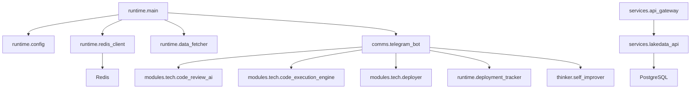

# Architecture Map

Status: read-only baseline, 2026-05-25.

No source, compose, dependency, image, container or volume mutation is
authorized by this document.

## Source Of Truth Status

- Active tree: `/Users/cuongnguyen/Workspace/Projects/finalAI`.
- Archived AIDEV tree with Git metadata:
  `/Users/cuongnguyen/Workspace/Archive/2026-05-24/AIDEV_merged_into_finalAI`.
- The active `finalAI` tree has no `.git` directory; handwritten versus
  generated provenance cannot yet be proven for every file.
- Archived Docker sample source:
  `/Users/cuongnguyen/Workspace/Archive/2026-05-25/imported-projects/welcome-to-docker`.

## Active Logical Boundaries

```text
finalAI
|-- runtime/main.py              process bootstrap
|-- runtime/config.py            environment configuration
|-- runtime/redis_client.py      Redis state access
|-- runtime/data_fetcher.py      scheduled Python docs fetcher
|-- runtime/deployment_tracker.py generated-module event storage
|-- runtime/system_analyzer.py   expected-structure comparison
|-- comms/telegram_bot.py        command transport and orchestration
|-- modules/tech/                code generation, execution, review, deploy
|-- modules/business/            merged AIDEV expert programming code
|-- services/api_gateway.py      HTTP gateway
|-- services/lakedata_api.py     PostgreSQL-backed query API
`-- thinker/                     scoring and self-improvement flow
```

## Observed Runtime Flow



## Verified Findings

- All 30 active Python files parse successfully without bytecode output.
- API gateway app construction and `/api/status` probe return HTTP `200`.
- Telegram `getMe` succeeds for the configured bot; this verifies credential
  reachability, not bot command authorization or polling runtime.
- LakeData health probe returns HTTP `503` while PostgreSQL is absent.
- No active schema/migration/init SQL creating the `lakedata` table was found.
- `redis-cli ping` fails because no Redis listener exists on `6379`.
- The current runtime writes logs and fetched data below source-relative
  `data/` paths when started.
- Telegram command paths currently reach arbitrary Python execution and module
  writes without a verified sender allowlist or safe module-name boundary.

## Mutation Gates

Before any structural change:

1. Review `FILESYSTEM_GRAPH.json`, `DEPENDENCY_GRAPH.json` and
   `RUNTIME_TOPOLOGY.json`.
2. Decide whether AIDEV merge is retained or restored from the archived Git
   tree.
3. Approve a minimal diff addressing only verified failures.
4. Validate behavior and image SBOM before cleanup or deployment.
