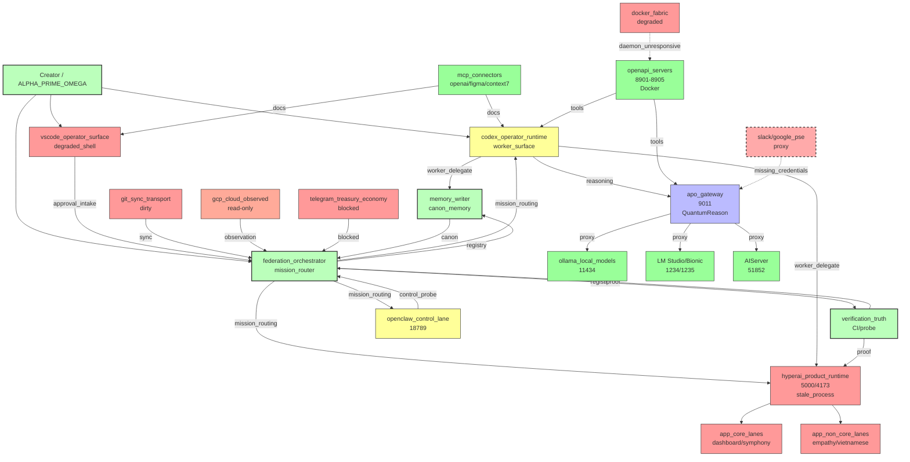

Subagent 1467ffa6 completed successfully:

# BÁO CÁO PHÂN TÍCH TOPOLOGY VÀ DEPENDENCY - HỆ SINH THÁI HYPERAI/AIOS

## A. DANH TÍNH VÀ MỤC ĐÍCH HỆ THỐNG

HyperAI/AIOS là một hệ thống thực thi thống nhất (unified execution system) hoạt động local-first, được thiết kế để nâng cấp, sử dụng, vận hành và tối ưu hóa các hệ thống AI, ứng dụng runtime, operator cockpits, provider fabrics, tools, verification, memory và các execution lanes downstream cho workflow của creator. Hệ thống không phải là một app server đơn lẻ hay một pool executor phẳng, mà là một mạng lưới các surface được phân loại theo runtime class, authority class, và được quản lý qua federation orchestrator với quy trình OODA (Observe-Orient-Decide-Act) tự chủ.

**Nguồn:** `/Users/andy/HyperAI-Sync/memory/AIOS_ECOSYSTEM_RUNTIME_REGISTRY_20260416.md` (dòng 5-8), `/Users/andy/HyperAI-Sync/runtime/federation_orchestrator/aios_ecosystem_runtime_registry.json` (dòng 5-10)

---

## B. TOPOLOGY (ĐỒ THỊ MERMAID)

---

## C. CATALOG SURFACE RUNTIME

| Surface | Runtime Class | Authority | Status | Control Interface | Capabilities | Proof Source | Dependencies |
|---------|---------------|-----------|--------|-------------------|--------------|--------------|--------------|
| **hyperai_product_runtime** | app_runtime | product_shell_authority | stale_process_runtime | http://127.0.0.1:5000, http://127.0.0.1:4173 | product_shell, dashboard, symphony, autonomy | tools/hyperai_autonomous_cycle.py, GET /api/health, npm run ci:build | backend/server.js, dist-isolated |
| **federation_orchestrator** | service_runtime | mission_router | usable_for_planning_and_routing | runtime/federation_orchestrator/*.json | mission_binding, surface_registry, drift_guard | runtime/federation_orchestrator/*.json | memory_writer, verification_truth |
| **memory_writer** | service_runtime | memory_authority | script_ready | python tools/update_memory.py | project_state_update, session_memory_update | memory/project_state.json, memory/work_journal.md | filesystem, git (optional) |
| **verification_truth** | verification_registry | verification_authority | ci_verification_ready | .github/workflows/ci.yml, npm run ci:build | runtime_probe, ci_build, browser_smoke | .github/workflows/ci.yml, runtime probes | hyperai_product_runtime |
| **codex_operator_runtime** | desktop_operator_runtime | worker_operator_surface | active | C:\Users\pc\.codex | read_trace_search, bounded_local_commands, mcp_routing | memory/AIOS_LOCAL_CODEX_OPERATOR_RUNTIME.md | federation_orchestrator, memory_writer |
| **openclaw_control_lane** | operator_control_surface | observed_control_lane | reachable_but_not_promoted | tools/openclaw_control.py, ws://127.0.0.1:18789 | gateway_health, browser_control_probe | runtime/federation_orchestrator/openclaw_proofs/*.json | federation_orchestrator |
| **local_fakeapi_provider_fabric** | provider_fabric | reasoning_api_compatibility_surface | live | http://127.0.0.1:9011 (apo_gateway) | openai_compatible_chat_shape, provider_routing | memory/AIOS_LOCAL_FAKEAPI_PROVIDER_FABRIC.md | ollama_local_models |
| **ollama_local_models** | model_substrate | inference_candidate | live | http://127.0.0.1:11434 | local_inference_candidate, model_inventory | runtime/federation_orchestrator/local_ai_model_inventory_20260415.json | local Windows profile |
| **lmstudio_bionic** | model_substrate | inference_candidate | live | http://127.0.0.1:1234/1235 | local_inference_candidate, embedding | memory/APΩ_BIONIC_SYSTEM_OVERVIEW_20260729T1130Z.md | LM Studio app, Bionic app |
| **mcp_connectors** | tool_bridge | connector_specific_capability | configured_minimal_core | .vscode/mcp.json | openai_docs, figma, context7, markitdown | AGENTS.md, .vscode/mcp.json | MCP servers |
| **vscode_operator_surface** | editor_operator_surface | creator_operator_surface | installed_extension_heavy_degraded_shell_policy_applies | VS Code / Insiders user profile | editor_surface, approval_intake, read_only_support | memory/AIOS_VSCODE_EXTENSION_DEGRADED_SHELL_POLICY.md | filesystem, extensions |
| **git_sync_transport** | sync_transport | transport_not_authority | many_repos_many_dirty | local Git repositories | compare, lineage_review, sync_transport | runtime/federation_orchestrator/titan_repo_sync_registry_20260415.json | git remotes |
| **gcp_cloud_observed** | cloud_substrate | observed_only | copied_observed_evidence | creator-owned GCP projects | future_read_only_inventory, provider_substrate_candidate | memory/AIOS_GCP_CLOUD_SUBSTRATE_OBSERVATION_20260415.md | GCP projects |
| **telegram_treasury_economy** | downstream_execution_group | blocked_or_gated_downstream | protected_first_dollar_pending | telegram_relay, treasury_control | publish_relay, funding_evidence, receive_only_treasury | memory/AIOS_ECONOMY_OPERATING_BRIEF.md | shell_authority |
| **openapi_servers** | openapi_tool_server | tool_surface | live | Docker on 8901-8905 | time, weather, filesystem, git, memory | /Users/andy/openapi-servers/compose.yaml | docker_fabric |
| **docker_fabric** | container_fabric | infrastructure_substrate | degraded | Docker Desktop | container runtime, MCP gateway | Docker daemon status | Docker Desktop |
| **slack_google_pse** | external_tool | proxy | missing_credentials | apo_gateway proxy | slack_proxy, google_pse_proxy | memory/project_state.json | apo_gateway |

**Nguồn:** `/Users/andy/HyperAI-Sync/runtime/federation_orchestrator/aios_ecosystem_runtime_registry.json` (toàn bộ), `/Users/andy/HyperAI-Sync/memory/AIOS_RUNTIME_CLASS_MATRIX_20260415.md`

---

## D. DEPENDENCY MAP

### Critical Dependencies

1. **federation_orchestrator** phụ thuộc vào:
   - memory_writer (để ghi registry và canon)
   - verification_truth (để validate runtime claims)
   - **Nếu thiếu:** Không thể routing mission, không thể phân loại surface, hệ thống mất khả năng điều phối

2. **hyperai_product_runtime** phụ thuộc vào:
   - backend/server.js (file canon)
   - dist-isolated (frontend build)
   - verification_truth (để prove runtime health)
   - **Nếu thiếu:** App shell không hoạt động, dashboard/symphony không truy cập được

3. **codex_operator_runtime** phụ thuộc vào:
   - federation_orchestrator (để lấy mission và surface registry)
   - memory_writer (để cập nhật memory)
   - apo_gateway/ollama (để reasoning)
   - **Nếu thiếu:** Worker surface không thể thực hiện HyperAI tasks, creator input không được xử lý theo protocol

4. **apo_gateway** phụ thuộc vào:
   - ollama_local_models (primary inference)
   - lmstudio_bionic (alternative inference)
   - credential broker (127.0.0.1:8765) cho API keys
   - **Nếu thiếu:** Không có reasoning capability, LLM calls fail

5. **verification_truth** phụ thuộc vào:
   - hyperai_product_runtime (để test endpoints)
   - npm run ci:build (để validate build)
   - **Nếu thiếu:** Không thể prove runtime changes, drift không được detect

6. **telegram_treasury_economy** phụ thuộc vào:
   - shell_authority (healthy)
   - creator proof
   - ledger proof
   - **Nếu thiếu:** Economy execution bị block, first-dollar state được bảo vệ

### Dependency Breakdown Scenarios

- **Nếu memory_writer fail:** Không thể cập nhật canon, memory stale, agent capsules không sync
- **Nếu docker_fabric degraded:** OpenAPI tool servers không chạy, MCP Docker gateway không available
- **Nếu slack/google_pse credentials missing:** External tool proxies không hoạt động
- **Nếu git_sync_transport dirty:** Không thể sync code giữa machines, rollback paths unclear

**Nguồn:** `/Users/andy/HyperAI-Sync/memory/AIOS_ECOSYSTEM_RUNTIME_REGISTRY_20260416.md` (dòng 54-63), `/Users/andy/HyperAI-Sync/memory/AIOS_INVARIANTS.md` (dòng 34-46)

---

## E. ROLE / RESPONSIBILITY BOUNDARIES

### federation_orchestrator
- **NÊN:** Mission routing, surface registry, drift guard, degradation policy, mission binding
- **KHÔNG ĐƯỢC:** Shell mutation without shell_authority, ledger mutation, provider identity claim
- **Authority:** mission_router, mission_root_when_template_allows, evidence_recorder_when_template_allows

### memory_writer
- **NÊN:** Memory write, task closure record, project_state update, work_journal append
- **KHÔNG ĐƯỢC:** Shell mutation, runtime authority, ledger mutation
- **Authority:** memory_authority (single evidence recorder)

### verification_truth
- **NÊN:** Runtime probe, CI build, browser smoke, proof artifact validation, drift detection
- **KHÔNG ĐƯỢC:** Business authority, runtime authority replacement
- **Authority:** verification_authority

### codex_operator_runtime
- **NÊN:** Creator input intake, mission dispatch initiator, agent chain bridge invoker, bounded implementation worker under gates, verification runner when gate opens, proof reporter
- **KHÔNG ĐƯỢC:** Mission root by label, direct product mutation without route plan, shell authority by label, ledger authority, cloud authority
- **Authority:** worker_operator_surface (KHÔNG PHẢI mission root mặc định)

### hyperai_product_runtime
- **NÊN:** Product shell authority cho proven core lanes (dashboard, symphony, runtime, autonomy), execution adapter for app boundary, evidence recorder for app runtime proof
- **KHÔNG ĐƯỢC:** OS repair authority, cloud authority, telegram publish authority, ledger spending authority, github identity authority, archive promotion authority
- **Authority:** product_shell_authority (chỉ cho proven core lanes)

### openclaw_control_lane
- **NÊN:** Operator control probe, browser control probe, approved bounded agent turn
- **KHÔNG ĐƯỢC:** Product shell authority, phone control by default, device pairing mutation by default, channel delivery by default, cron mutation by default, external delivery by default
- **Authority:** observed_control_lane (KHÔNG PHẢI app authority)

### telegram_treasury_economy
- **NÊN:** Planning, read-only review, receive-only evidence when gate open
- **KHÔNG ĐƯỢC:** Fabricate publish confirmation, fabricate funding confirmation, autonomous wallet action, business truth without evidence
- **Authority:** blocked_or_gated_downstream (execution blocked until gates open)

**Nguồn:** `/Users/andy/HyperAI-Sync/runtime/federation_orchestrator/aios_ecosystem_runtime_registry.json` (mỗi surface entry), `/Users/andy/HyperAI-Sync/memory/AIOS_INVARIANTS.md` (dòng 24-31)

---

## F. CURRENT GAPS / PROJECTION MISSING

### 1. Product Runtime Projection Missing
- **Status:** `projection_missing` - Canonical HyperAI product runtime không reachable trên macOS
- **Issue:** `hyperai_product_runtime` là Windows-only (C:\Users\pc\HyperAI_Phoenix_Master\hyperai-user-control-system), không có trên Mac hiện tại
- **Evidence:** `/Users/andy/HyperAI-Sync/memory/work_journal.md` (dòng 1-6, 10-13, 20-23, 36-51), `/Users/andy/HyperAI-Sync/runtime/federation_orchestrator/aios_ecosystem_runtime_registry.json` (dòng 33-39)
- **Impact:** Dashboard, symphony, autonomy UI không truy cập được, app shell authority bị mất

### 2. Docker Fabric Degraded
- **Status:** Docker daemon unresponsive
- **Issue:** Docker Desktop không respond, container build/test bị block
- **Evidence:** `/Users/andy/HyperAI-Sync/memory/work_journal.md` (dòng 31-32, 54)
- **Impact:** OpenAPI tool servers (8901-8905) không chạy, Docker MCP gateway không available

### 3. Slack/Google PSE Credentials Missing
- **Status:** Missing credentials
- **Issue:** Slack và Google PSE proxy không hoạt động do thiếu API keys
- **Evidence:** `/Users/andy/HyperAI-Sync/runtime/federation_orchestrator/ooda_control_contract.json` (dòng 14)
- **Impact:** External tool proxies không available

### 4. Bionic Embedding Worker Missing
- **Status:** FAIL 400
- **Issue:** Bionic embedding worker file missing tại /Applications/Bionic.app/Contents/Resources/app/.webpack-bionic/lib/embeddingworker.js
- **Evidence:** `/Users/andy/HyperAI-Sync/memory/project_state.json` (dòng 4)
- **Impact:** Embedding endpoint fail, vector search không hoạt động

### 5. Git Sync Transport Dirty
- **Status:** many_repos_many_dirty
- **Issue:** Nhiều Git repositories ở trạng thái dirty, sync transport không automatic
- **Evidence:** `/Users/andy/HyperAI-Sync/runtime/federation_orchestrator/aios_ecosystem_runtime_registry.json` (dòng 619-651)
- **Impact:** Code sync giữa machines bị block, rollback paths unclear

### 6. Shell Authority Degraded
- **Status:** degraded
- **Issue:** shell_authority = degraded, economy execution bị block
- **Evidence:** `/Users/andy/HyperAI-Sync/memory/AIOS_RUNTIME_CLASS_MATRIX_20260415.md` (dòng 10-11), `/Users/andy/HyperAI-Sync/memory/AIOS_INVARIANTS.md` (dòng 62-87)
- **Impact:** Docker reset, WSL reset, OS reinstall, economy execution, wallet action, auto-deploy bị block

### 7. First-Dollar State Protected
- **Status:** protected_first_dollar_pending
- **Issue:** Telegram economy execution bị block cho đến khi shell authority healthy và creator proof available
- **Evidence:** `/Users/andy/HyperAI-Sync/runtime/federation_orchestrator/aios_ecosystem_runtime_registry.json` (dòng 688-732), `/Users/andy/HyperAI-Sync/memory/agent6_synthesis_capsule.md` (dòng 93-96)
- **Impact:** Monetization execution không thể chạy

**Nguồn:** `/Users/andy/HyperAI-Sync/memory/work_journal.md`, `/Users/andy/HyperAI-Sync/memory/project_state.json`, `/Users/andy/HyperAI-Sync/runtime/federation_orchestrator/ooda_control_contract.json`

---

## G. INVARIANTS / NON-NEGOTIABLE RULES (TOP 10)

1. **Root Host Conservation** - Windows host plus root filesystem là local runtime source of truth. KHÔNG thực hiện OS reset, Docker factory reset, WSL reset, hoặc root runtime deletion. Major root-host change phải bind đến mission và có rollback plan.
   - **Nguồn:** `/Users/andy/HyperAI-Sync/memory/AIOS_INVARIANTS.md` (dòng 11-23)

2. **Single Mission Root / Authority** - Mọi action quan trọng phải bind đến một mission template explicit. Không surface nào có thể self-promote đến authority (bao gồm VS Code, browsers, Telegram, Docker UI, extensions, editor agents, chat surfaces). Mission authority phải explicit và là duy nhất approval path cho material changes.
   - **Nguồn:** `/Users/andy/HyperAI-Sync/memory/AIOS_INVARIANTS.md` (dòng 24-33)

3. **Single Evidence Recorder / Memory Writer** - Chỉ một official path được phép write canonical docs hoặc memory. Changes đến shell/root-host status, economy lane status, invariant status, mission/readiness status phải được viết qua memory writer và corresponding .md hoặc .json artifacts. Implicit side-channel notes KHÔNG phải canon.
   - **Nguồn:** `/Users/andy/HyperAI-Sync/memory/AIOS_INVARIANTS.md` (dòng 34-46)

4. **Verification Truth Gate** - Không fact hoặc state change được accept mà không có evidence (log, artifact, ledger evidence, file evidence, explicit proof artifact). KHÔNG promote browser, editor, chat, Telegram, hoặc draft output đến canon mà không có verification-gate proof.
   - **Nguồn:** `/Users/andy/HyperAI-Sync/memory/AIOS_INVARIANTS.md` (dòng 47-59)

5. **Shell Authority And Runtime Safety** - shell_state = healthy | degraded. Nếu shell_authority = degraded, system phải block: Docker reset, WSL reset, OS reinstall, economy execution, wallet action, auto-deploy. Allowed khi degraded: preservation, analysis, trace, planning, memory update, evidence collection. Runtime probe beyond read-only phải có rollback plan.
   - **Nguồn:** `/Users/andy/HyperAI-Sync/memory/AIOS_INVARIANTS.md` (dòng 61-88)

6. **Economy Invariants** - First-dollar state là invariant trừ khi changed qua evidence-recorder proof (publish event IDs, funding event IDs, artifact paths, related objective state). Economy execution chỉ được phép khi: root host conserved, shell proof stable, degradation policy không block route, creator acknowledgement explicit và event-specific, evidence recorder confirms event. Nếu conditions không satisfied, economy status phải là blocked_cleanly, không ambiguous.
   - **Nguồn:** `/Users/andy/HyperAI-Sync/memory/AIOS_INVARIANTS.md` (dòng 89-107)

7. **Lane Separation** - Giữ các lanes riêng biệt: reasoning lane (LLMs, planners, IDE copilots), approval lane (creator và mission authority), execution lane (Docker, WSL, HCS, OS-level actions, deploy pipelines), economy lane (wallet, funding, TON, reconciliation), lineage/archive lane (capsules, logs, docs, observers). Chỉ execution lanes được phép mutate real-world runtime state. Execution lanes được gated bởi shell status, mission binding, và rollback plan.
   - **Nguồn:** `/Users/andy/HyperAI-Sync/memory/AIOS_INVARIANTS.md` (dòng 108-119)

8. **Invariant Under Failure** - Nếu Docker, WSL, HCS, hoặc runtime khác fail: KHÔNG change root invariants, accept shell_authority = degraded, move system đến preservation/analysis mode, KHÔNG repair bằng reset mà breaks invariants. System có thể continue: reasoning, planning, audit, memory update, evidence collection, controlled repair planning.
   - **Nguồn:** `/Users/andy/HyperAI-Sync/memory/AIOS_INVARIANTS.md` (dòng 120-137)

9. **Re-Audit Requirement** - Bất kỳ major change nào trong shell status, economy status, hoặc root-host status yêu cầu re-audit của: T, G(t), Th, W, F, D, Trust(S) sử dụng standardized formulas.
   - **Nguồn:** `/Users/andy/HyperAI-Sync/memory/AIOS_INVARIANTS.md` (dòng 138-158)

10. **Worker Runtime Binding** - Codex và các AI/operator/tool runtimes khác là worker surfaces của HyperAI khi task thuộc về HyperAI operation. Receiving user input KHÔNG làm receiving surface trở thành mission root hoặc execution authority. Input vào Codex cho HyperAI work có nghĩa là Codex acts as worker/operator surface và phải follow HyperAI orchestration semantics.
    - **Nguồn:** `/Users/andy/HyperAI-Sync/runtime/federation_orchestrator/worker_runtime_binding_policy.json` (dòng 5-10), `/Users/andy/HyperAI-Sync/AGENTS.md` (dòng 97-101)

---

## H. SOCRATIC NEXT QUESTIONS (3 CÂU HỎI TÌM KIẾM BẰNG CHỨNG)

1. **Product Runtime Cross-Platform Strategy:** Với hyperai_product_runtime hiện tại là Windows-only và không có trên macOS (projection_missing), chiến lược cross-platform là gì? Có nên port hyperai-user-control-system sang macOS, hay nên xây dựng một alternative product runtime cho Mac, hay nên điều chỉnh federation orchestrator để hoạt động với các local tool surfaces khác khi product runtime không available?
   - **Rationale:** Cần hiểu rõ architecture decision cho cross-platform trước khi expand system.

2. **Docker Fabric Recovery Path:** Docker daemon hiện tại unresponsive và degraded. Recovery path ưu tiên là gì? Có nên start Docker Desktop và fix daemon, hay nên route-around Docker bằng cách sử dụng alternative execution substrates (SSH remote hosts, cloud substrate, local fakeAPI) cho đến khi Docker được fix?
   - **Rationale:** Docker là critical substrate cho OpenAPI tool servers và MCP gateway. Cần biết recovery priority trước khi expand.

3. **Economy Execution Gate Conditions:** Với shell_authority degraded và first-dollar state protected, conditions cụ thể để unblock economy execution là gì? Có cần shell authority healthy, hay có thể use route-around proof contract để enable economy execution trong degraded state? Creator acknowledgement format là gì?
   - **Rationale:** Economy execution là critical downstream lane. Cần hiểu rõ gate conditions trước khi enable monetization.

---

**Tổng hợp dựa trên các tài liệu canonical:**
- `/Users/andy/HyperAI-Sync/memory/AIOS_AUTONOMOUS_OODA_WORKFLOW.md`
- `/Users/andy/HyperAI-Sync/memory/agent1_ontology_scope_capsule.md`
- `/Users/andy/HyperAI-Sync/memory/agent2_runtime_entrypoint_capsule.md`
- `/Users/andy/HyperAI-Sync/memory/agent3_api_client_contract_capsule.md`
- `/Users/andy/HyperAI-Sync/memory/agent4_frontend_composition_capsule.md`
- `/Users/andy/HyperAI-Sync/memory/agent5-ci-verification-capsule.md`
- `/Users/andy/HyperAI-Sync/memory/agent6_synthesis_capsule.md`
- `/Users/andy/HyperAI-Sync/memory/AIOS_ECOSYSTEM_RUNTIME_REGISTRY_20260416.md`
- `/Users/andy/HyperAI-Sync/memory/AIOS_RUNTIME_CLASS_MATRIX_20260415.md`
- `/Users/andy/HyperAI-Sync/memory/AIOS_CONNECTOR_CANON_MAP.md`
- `/Users/andy/HyperAI-Sync/memory/AIOS_INVARIANTS.md`
- `/Users/andy/HyperAI-Sync/memory/aios_ecosystem_overview_diagram.mmd`
- `/Users/andy/HyperAI-Sync/runtime/federation_orchestrator/aios_ecosystem_runtime_registry.json`
- `/Users/andy/HyperAI-Sync/runtime/federation_orchestrator/worker_runtime_binding_policy.json`
- `/Users/andy/HyperAI-Sync/runtime/federation_orchestrator/ooda_control_contract.json`
- `/Users/andy/AGENTS.md`
- `/Users/andy/HyperAI-Sync/AGENTS.md`
- `/Users/andy/HyperAI-Sync/memory/project_state.json`
- `/Users/andy/HyperAI-Sync/memory/work_journal.md`