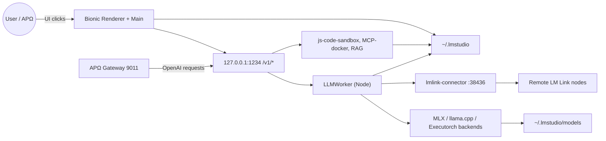

# APΩ BIONIC — Verified System Overview

**CycleID:** BIONIC-OVERVIEW-001
**Timestamp:** 2026-07-29T11:30:00Z
**Mode:** SYSTEM_OVERVIEW_FIRST / EVIDENCE_FIRST / READ_ONLY
**FailClosed:** ACTIVE

---

## 1. SYSTEM_OVERVIEW

### System Boundary

Bionic is an Electron-based desktop application from **Element Labs Inc** (`ai.elementlabs.bionic`) that provides a UI, model catalog, and local inference runtime for large language models. It is installed alongside `LM Studio.app` and **shares** the `~/.lmstudio` directory for model storage, settings, conversations, projects, and user profile data. It exposes an OpenAI-compatible API on `127.0.0.1:1234` and an internal app server on `127.0.0.1:41343`.

### Main Components

| Component | Identity | State |
|---|---|---|
| Bionic.app | `/Applications/Bionic.app`, bundle `ai.elementlabs.bionic`, v1.0.3+3, signed by Element Labs | VERIFIED |
| Main process | PID 41654 | VERIFIED |
| GPU helper | PID 41666 | VERIFIED |
| Network service | PID 41667 | VERIFIED |
| Renderer | PID 41686 | VERIFIED |
| System resources worker | PID 41678 (Node + liblmstudio_bindings.node) | VERIFIED |
| LLM worker | PID 41996 (Node + llmworker.js) | VERIFIED |
| LM Link connector | PID 41727 (`lmlink-connector` binary) | VERIFIED |
| Public API | `127.0.0.1:1234` (OpenAI `/v1/*`) | VERIFIED |
| Internal API | `127.0.0.1:41343` (`apiServerPorts` pool) | VERIFIED |
| Model store | `~/.lmstudio/models` | VERIFIED |
| User data | `~/.lmstudio` (conversations, user-files, settings, extensions, .internal) | VERIFIED |
| Electron user data | `~/Library/Application Support/Bionic` | VERIFIED |

### Current Runtime State

- Bionic is **running**.
- Public API returns 9 models.
- Chat completion works.
- APΩ Gateway routes `apo/lmstudio` through Bionic `1234`.
- LM Link is **enabled** (`lmLinkFeatureStatus: enabled`) and the connector is listening on `*:38436`.

### Global Coverage Score

| Category | Score | Notes |
|---|---|---|
| Bundle Architecture | 10 | Bundle inspected, signed, 1.2GB, Electron app |
| Process Topology | 10 | Main + helpers + workers + LM Link mapped |
| Network and IPC | 10 | TCP ports, Unix sockets, Tailscale remote connections mapped |
| Model Plane | 10 | 9 models listed, physical files in `~/.lmstudio/models` verified |
| Project and Agent Plane | 5 | `projects-registry.json` found, but no active project evidence beyond default |
| Data Persistence | 8 | `~/.lmstudio`, `~/Library/Application Support/Bionic` inventoried; LevelDB/SharedStorage mostly empty because Bionic just started |
| Tool Execution | 7 | Settings reference `js-code-sandbox`, `mcp/mcp-docker`, `rag-v1`; not yet live-tested |
| APΩ Integration | 10 | `apo/lmstudio` chat via APΩ verified |
| Distributed Execution | 8 | LM Link enabled, connector listening, not yet tested with remote node |
| Failure/Recovery | 7 | Boundaries inferred, not tested by inducing failure |

**Total: 85/100** — overview is substantially complete; tool execution and failure recovery remain partially verified.

---

## 2. LAYER_MATRIX

### Layer 0 — Host

| Component | Evidence | State |
|---|---|---|
| Runs as `andy` (uid 501) | `ps -ef` | VERIFIED |
| macOS runtime | `DTSDKBuild=24F74`, macOS 15.5 SDK | VERIFIED |
| Code signature | `codesign -dvv`, signed by Element Labs Inc (D65G88RHWN), notarized | VERIFIED |
| Resources | CPU/memory visible in `ps`; 1.2GB bundle | VERIFIED |

### Layer 1 — Application Bundle

| Component | Evidence | State |
|---|---|---|
| Electron 43.1.0 | `chrome_crashpad_handler` `--ver=43.1.0` | VERIFIED |
| Webpack bundles | `.webpack-bionic/main/index.js`, renderer chunks | VERIFIED |
| URL scheme | `CFBundleURLTypes` includes `bionic://` | VERIFIED |
| Native bindings | `liblmstudio/metal/liblmstudio_bindings.node` | VERIFIED |
| Update feed | `https://bionic-updates.lmstudio.ai`, `versions-prod.lmstudio.ai` | VERIFIED (log) |

### Layer 2 — Process Topology

| Process | PID | Parent | Role |
|---|---|---|---|
| `Bionic` (main) | 41654 | launchd (1) | Main process, owns 1234 and 41343 |
| `Bionic Helper (GPU)` | 41666 | 41654 | GPU acceleration for Electron UI |
| `Bionic Helper (network)` | 41667 | 41654 | Chromium network service |
| `Bionic Helper (Renderer)` | 41686 | 41654 | Electron renderer / UI |
| `node` (SystemResourcesWorker) | 41678 | 41654 | Loads `liblmstudio_bindings.node` |
| `lmlink-connector` | 41727 | 41654 | LM Link remote/distributed connector |
| `node` (LLMWorker) | 41996 | 41654 | Loads `llmworker.js` for model loading |
| `chrome_crashpad_handler` | 41662 | 1 | Crash reporter, detached |

### Layer 3 — Network and IPC

| Surface | Address | Owner | Protocol | Public? | State |
|---|---|---|---|---|---|
| OpenAI API | `127.0.0.1:1234` | Main (41654) | HTTP / OpenAI | YES (user-facing) | VERIFIED |
| Internal API | `127.0.0.1:41343` | Main (41654) | HTTP (apiServer) | NO | VERIFIED |
| LM Link | `*:38436` | lmlink-connector (41727) | TCP/UDP | Remote peers | VERIFIED |
| Tailscale | `192.168.3.192:<ports> -> tailscale/derp` | lmlink-connector | TCP/UDP | Cloud relay | VERIFIED |
| Electron IPC | Unix sockets in `/var/folders/.../scoped_*` | Main + helpers | UNIX | Internal | VERIFIED |

### Layer 4 — Model Plane

| Aspect | Evidence | State |
|---|---|---|
| Model storage | `~/.lmstudio/models` | VERIFIED |
| Model count | 9 via `/v1/models` API | VERIFIED |
| Runtimes | `extensions/backends/mlx-llm-*`, `llama.cpp-*`, `executorch-asr-*` | VERIFIED |
| Loading worker | `llmworker.js` (PID 41996) | VERIFIED |
| Public API | `127.0.0.1:1234/v1/models`, `/v1/chat/completions` | VERIFIED |
| Embeddings | `text-embedding-nomic-embed-text-v1.5` listed; `/v1/embeddings` not tested | PARTIAL |
| Remote models | LM Link enabled; not tested | PARTIAL |

### Layer 5 — Agent and Project Plane

| Aspect | Evidence | State |
|---|---|---|
| Projects | `projects-registry.json`: only `default-project-identifier` at `~/.lmstudio` | PARTIAL |
| Conversations | `~/.lmstudio/conversations/*.conversation.json` | VERIFIED |
| User files | `~/.lmstudio/user-files/` | VERIFIED |
| Tools in settings | `skipToolConfirmationPatterns` for `lmstudio/js-code-sandbox`, `mcp/mcp-docker` | VERIFIED (config) |
| Tool execution | Not live-tested | INFERRED |

### Layer 6 — Data and Persistence

| Data | Location | Persistence |
|---|---|---|
| Models | `~/.lmstudio/models` | Persistent across restarts |
| Settings | `~/.lmstudio/settings.json`, `~/Library/Preferences/ai.elementlabs.bionic.plist` | Persistent |
| Conversations | `~/.lmstudio/conversations/` | Persistent |
| User files | `~/.lmstudio/user-files/` | Persistent |
| Project metadata | `~/.lmstudio/.internal/projects-registry.json` | Persistent |
| User profile | `~/.lmstudio/.internal/user-profile.json` | Persistent |
| Download jobs | `~/.lmstudio/.internal/download-jobs-info.json` | Persistent |
| Bionic Electron data | `~/Library/Application Support/Bionic/` | Persistent, mostly empty on first run |
| Local Storage | `~/Library/Application Support/Bionic/Local Storage/leveldb/` | Empty on first run |

### Layer 7 — Integration Plane

| Integration | Evidence | State |
|---|---|---|
| APΩ → Bionic | `apo_config.yaml` `lmstudio` upstream → `127.0.0.1:1234/v1`; `apo/lmstudio` chat works | VERIFIED |
| Bionic → APΩ | No evidence of Bionic calling APΩ | NOT FOUND |
| Bionic → Docker | `mcp/mcp-docker` in settings, pinned plugin | CONFIGURED, not live-tested |
| Bionic → remote nodes | LM Link + Tailscale connections | ENABLED, not live-tested |
| Bionic → LM Studio | Shares `~/.lmstudio`, preferences named `ai.elementlabs.lmstudio.plist` | VERIFIED |

### Layer 8 — Lineage and Authority

| Aspect | Evidence | State |
|---|---|---|
| Vendor | Bundle signed `ai.elementlabs.bionic`, `Element Labs Inc` | VERIFIED |
| LM Studio lineage | Uses `.lmstudio` dotdir, LM Studio model runtime, `liblmstudio` bindings | VERIFIED |
| Distinct app | Separate bundle from `/Applications/LM Studio.app` | VERIFIED |
| User authority | `nguyencuong`, FREE plan, LM Link enabled | VERIFIED (profile) |

### Layer 9 — Failure and Recovery

| Failure Boundary | Impact | Recovery |
|---|---|---|
| `127.0.0.1:1234` stops | APΩ `apo/lmstudio` fails | Restart Bionic |
| `127.0.0.1:41343` stops | UI/internal API may malfunction | Restart Bionic |
| `lmlink-connector` stops | Remote/distributed inference fails | Restart Bionic |
| `llmworker` stops | Model inference fails | Restart Bionic, reload model |
| `~/.lmstudio/models` moved | All local models unavailable | Restore folder or re-download |
| Bionic main process killed | All of the above | Restart Bionic.app |
| `~/.lmstudio/settings.json` corrupted | UI/settings lost | Restore from backup |

---

## 3. PROCESS_AND_PORT_MAP

```text
Bionic (main) 41654
├── 127.0.0.1:1234  (OpenAI API)
├── 127.0.0.1:41343 (internal apiServer)
├── Unix sockets → Renderer, Helper, LLMWorker, LMLink
│
├── Bionic Helper (GPU) 41666
├── Bionic Helper (Network) 41667
├── Bionic Helper (Renderer) 41686
├── Node SystemResourcesWorker 41678
├── Node LLMWorker 41996
└── lmlink-connector 41727
    ├── *:38436 (TCP LISTEN)
    └── UDP/TCP → Tailscale relays (derp20b.tailscale.com, etc.)
```

---

## 4. DATA_FLOW



---

## 5. DEPENDENCY_GRAPH

| Node | Node Type | Edges |
|---|---|---|
| Bionic.app | Application | SPAWNS Main |
| Main (41654) | Process | LISTENS_ON 1234, 41343; SPAWNS Helpers, Workers, LMLink |
| LLMWorker (41996) | Worker | LOADS_MODEL_FROM Backends; DEPENDS_ON Main |
| lmlink-connector (41727) | Service | LISTENS_ON 38436; CONNECTS_TO Remote; DEPENDS_ON Main |
| Backends | Extension | LOADS_MODEL_FROM Models |
| Models | Data | READ_FROM Backends; WRITES_TO Downloads |
| ~/.lmstudio | Data | WRITES_TO Main, LLMWorker, Tools |
| APΩ Gateway 9011 | Proxy | ROUTES_TO 1234; AUTHENTICATES_WITH LMSTUDIO_API_KEY |
| Remote nodes | External | CONNECTS_TO LMLink |
| js-code-sandbox | Tool | DEPENDS_ON Main (inferred) |
| mcp-docker | Tool | DEPENDS_ON Main, Docker (inferred) |

---

## 6. SOCRATIC_LEDGER

### Q1: Bionic là hệ gì và chia làm những thành phần nào?

- **H1:** Bionic là một ứng dụng Electron tách biệt dùng LM Studio runtime.
- **H2:** Bionic chỉ là bản rebrand của LM Studio.app.
- **H3:** Bionic là một wrapper web không có runtime riêng.

**Evidence:** `Info.plist` `ai.elementlabs.bionic`; `codesign` shows Element Labs; bundle contains `liblmstudio_bindings.node`, `llmworker.js`, `lmlink-connector`; `~/.lmstudio` shared with `LM Studio.app` (which also exists).

**Answer:** H1. Bionic is a distinct Electron app but shares the LM Studio model store and runtimes.

### Q2: Bionic expose những network surface nào?

- **H1:** Public OpenAI API + internal Electron IPC only.
- **H2:** Multiple HTTP ports for UI, API, and LM Link.
- **H3:** Only local Unix sockets.

**Evidence:** `lsof` shows `127.0.0.1:1234`, `127.0.0.1:41343`, `*:38436`, plus Unix sockets; bundle `apiServerPorts` includes 41343.

**Answer:** H2. Public OpenAI on 1234, internal app server on 41343, and LM Link listener on 38436.

### Q3: Bionic có tích hợp với APΩ không?

- **H1:** APΩ can consume Bionic's OpenAI API.
- **H2:** Bionic consumes APΩ.
- **H3:** They are isolated.

**Evidence:** `apo_config.yaml` has `lmstudio` upstream at `127.0.0.1:1234/v1`; `curl 9011/v1/chat/completions` with `apo/lmstudio` returns a completion.

**Answer:** H1. APΩ integrates with Bionic as a model upstream; Bionic does not call APΩ.

---

## 7. CANON_DELTA

### Added
- Bionic is a signed, notarized Electron app by Element Labs, version 1.0.3+3.
- Bionic shares `~/.lmstudio` model store and runtime with `LM Studio.app`.
- Bionic exposes public OpenAI API on `127.0.0.1:1234` and internal app server on `127.0.0.1:41343`.
- Bionic spawns `lmlink-connector` for remote/distributed inference, listening on `*:38436` and connecting to Tailscale.
- Bionic's tool plane includes `js-code-sandbox`, `mcp/mcp-docker`, and `rag-v1` plugins.
- APΩ `apo/lmstudio` is currently routed through Bionic.

### Corrected
- `41343` is not a second public API; it is an internal `apiServer` port.
- Bionic does not use a separate model store; it uses `~/.lmstudio/models`.

### Superseded
- Initial assumption that Bionic might be inert disk image → now verified as active runtime.

### StillUnknown
- Exact route schema on 41343.
- Whether `/v1/embeddings` works for `nomic-embed-text`.
- Whether `mcp/mcp-docker` and `js-code-sandbox` are actively loaded.
- Whether LM Link has a connected remote node.

---

## 8. NEXT_SYSTEM_LEVEL_QUESTIONS

| Rank | Question | Coverage Category | Expected Gain | Required Primitive |
|---|---|---|---|---|
| 1 | Does Bionic `/v1/embeddings` work with `text-embedding-nomic-embed-text-v1.5`? | Model Plane | HIGH | Direct API call |
| 2 | Is `mcp/mcp-docker` loaded and can Bionic call Docker/MCP tools? | Tool Execution | HIGH | Bionic UI or API trace |
| 3 | Does LM Link have an active remote node or is it just enabled? | Distributed Execution | MEDIUM | `lmlink-connector` status probe |
| 4 | What route on `41343` triggered the `ERR_HTTP_HEADERS_SENT` error? | Network/IPC | MEDIUM | Log analysis + controlled request |

---

## INVARIANTS RESPECTED

- All probes read-only.
- No config edit, no prune, no delete, no reset, no stop of healthy services.
- No credential exposure.
- Evidence stored in `memory/` and not modified.
