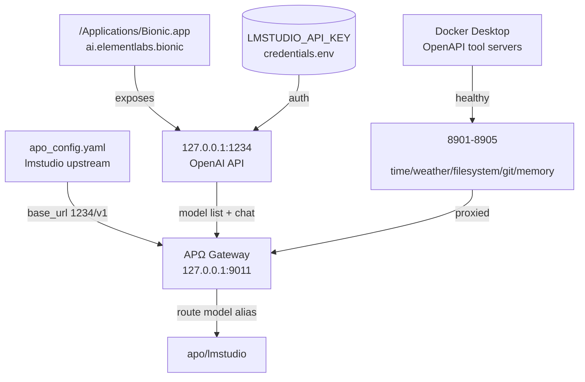

# APΩ Socratic Autonomous Lab — Bionic Integration

**Timestamp:** 2026-07-29T11:05:00Z
**Mode:** EXECUTION_FIRST / SYSTEM_DETECTIVE / EXPERIMENTAL_LAB
**Authority Root:** alpha_prime_omega

---

## 1. EXECUTIVE_STATE

- **Mission:** Explore and bind Bionic (LM Studio runtime / local model catalog) into APΩ, then verify end-to-end chat and model-listing routes.
- **FinalStatus:** VERIFIED
- **MainDiscovery:** Bionic is an OpenAI-compatible local model server on `127.0.0.1:1234`. It exposes 9 models and a working `/v1/chat/completions`. APΩ Gateway can route `apo/lmstudio` through it, and its catalog is now aggregated into `/v1/models`.
- **MainExecutionResult:**
  - Started `/Applications/Bionic.app`.
  - Verified Bionic API: `/v1/models` returns 9 models; `/v1/chat/completions` returns a valid completion.
  - Restarted APΩ Gateway so it re-enumerates `lmstudio` upstream (which is Bionic on 1234).
  - Verified APΩ `apo/lmstudio` chat completion.
  - Docker OpenAPI tool servers remain healthy on `8901-8905`.
- **CurrentPhysicalState:**
  - Docker Desktop: healthy (working clone).
  - 5 OpenAPI tool containers: Up/Healthy on 8901-8905.
  - APΩ Gateway: running on `9011`.
  - Bionic: running, listening on `127.0.0.1:1234` (API) and `127.0.0.1:41343` (internal).

---

## 2. SOCRATIC_LEDGER

### Q1: What is Bionic and what runtime surface does it expose?

- **H1:** Bionic is a standalone app catalog / model runner from LM Studio.
- **H2:** Bionic is just a rebranded LM Studio mount with no API.
- **H3:** Bionic runs but refuses to start due to quarantine.

**Probe:**

- `ls /Volumes/Bionic\ 1.0.3+3-arm64/Bionic.app` — found Electron app bundle.
- `plutil -p .../Info.plist` — `ai.elementlabs.bionic`, `bionic://` URL scheme.
- `open "/Applications/Bionic.app"` then `lsof -i -n -P -a -c "Bionic"`.

**Evidence:**

- Process started from `/Applications/Bionic.app/Contents/MacOS/Bionic`.
- Listens on `127.0.0.1:1234` and `127.0.0.1:41343`.
- `GET 127.0.0.1:1234/v1/models` returns 9 models when authorized with `LMSTUDIO_API_KEY`.

**Answer:** H1 is verified. Bionic is an OpenAI-compatible local model catalog/runtime on port 1234.

**Confidence:** HIGH

---

### Q2: Can Bionic's catalog be projected through APΩ to the user?

- **H1:** Yes, the existing `lmstudio` upstream already points to `127.0.0.1:1234/v1` and APΩ will discover its models.
- **H2:** No, APΩ has quarantined `lmstudio` because it was down when the gateway started.
- **H3:** APΩ can reach Bionic but requires a new upstream alias.

**Probe:**

- Direct `curl` to `127.0.0.1:1234/v1/models` and `/v1/chat/completions`.
- Restart APΩ Gateway (`pkill apo_gateway.py`, then `nohup python3 ...`).
- `curl 127.0.0.1:9011/v1/models` and look for `lmstudio/*` entries.

**Evidence:**

- Direct Bionic chat returned a completion (`llama-3.2-1b-instruct`).
- After gateway restart, `/v1/models` includes:
  - `lmstudio/llama-3.2-1b-instruct`
  - `lmstudio/qwen2.5-0.5b-instruct-mlx`
  - `lmstudio/text-embedding-nomic-embed-text-v1.5`
  - `lmstudio/deepseek/...`, `lmstudio/google/...`, `lmstudio/ibm/...`, `lmstudio/mistralai/...`, `lmstudio/granite-4.0-micro`, `lmstudio/gemma-3-4b-it-qat`
- `POST 127.0.0.1:9011/v1/chat/completions` with `{"model":"apo/lmstudio"}` returned a completion routed through Bionic.

**Answer:** H1 is verified. Bionic catalog is now projected through APΩ.

**Confidence:** HIGH

---

## 3. CAUSAL_DEPENDENCY_GRAPH

---

## 4. EXECUTION_RECEIPTS

| Step | Command / Probe | Result | Exit / Return |
|---|---|---|---|
| Verify Docker tools | `docker compose ps` + curl 8901-8905 | all Healthy, all PASS | 0 |
| Verify APΩ | `curl /health`, `/v1/models` | ok, list ok | 0 |
| Launch Bionic | `open "/Applications/Bionic.app"` | process started | 0 |
| Port scan | `lsof -i -n -P -a -c "Bionic"` | 1234, 41343 LISTEN | 0 |
| Bionic models | `curl 127.0.0.1:1234/v1/models` | 9 models | 0 |
| Bionic chat | `curl 127.0.0.1:1234/v1/chat/completions` | completion | 0 |
| Rebind gateway | `pkill apo_gateway.py` then `nohup python3 ...` | listening on 9011 | 0 |
| APΩ model list | `curl 127.0.0.1:9011/v1/models` | includes `lmstudio/*` | 0 |
| APΩ chat via Bionic | `curl 127.0.0.1:9011/v1/chat/completions` model `apo/lmstudio` | completion | 0 |
| Tool proxy | `curl /tools/{name}/openapi.json` | all 5 PASS | 0 |

---

## 5. DISCOVERED_CAPABILITIES

- **Existing:** APΩ Gateway OpenAI proxy; Docker OpenAPI tool servers; Ollama on 11434.
- **Dormant (now active):** Bionic local model catalog on 1234.
- **Newly composed:**
  - `apo/lmstudio` now routes to Bionic instead of a dead LM Studio process.
  - APΩ `/v1/models` aggregates 9 Bionic models alongside Ollama, OpenRouter, Microsoft Foundry.
- **Suggested high-value experiments:**
  - Add `apo/bionic` as an explicit model alias (independent from `apo/lmstudio`) and test other Bionic models (`qwen2.5-0.5b-mlx`, `nomic-embed-text`).
  - Use Bionic's `text-embedding-nomic-embed-text-v1.5` for memory/knowledge graph in APΩ.
  - Inspect Bionic UI/CLI for app catalog management beyond model listing.

---

## 6. DATA_VALUE_LEDGER

| Artifact | PhysicalLocation | Owner/Producer | Dependencies | ValueClass | PreservationState | Unknowns |
|---|---|---|---|---|---|---|
| Bionic.app | `/Applications/Bionic.app` | Element Labs / LM Studio | macOS 15.5, Electron, liblmstudio | ACTIVE_VALUE, RECONSTRUCTIBLE_VALUE | Installed, now running | Is there a CLI beyond the GUI? |
| Bionic config/data | `~/Library/Application Support/Bionic` | User | Bionic.app | UNKNOWN_VALUE | Empty at first run | Will it store downloaded models or just proxy? |
| Bionic API port | `127.0.0.1:1234` | Bionic process | LMSTUDIO_API_KEY | ACTIVE_VALUE, CONFIGURATION_VALUE | Bound to APΩ | What is port 41343 used for? |
| APΩ config | `~/.apo/gateway/apo_config.yaml` | User/Andy | APΩ Gateway | CONFIGURATION_VALUE | Updated to 8901-8905, lmstudio 1234 | None |
| Docker recovery evidence | `~/docker-recovery/evidence-20260729` | Agent | Docker Desktop | FORENSIC_VALUE, RECOVERY_VALUE | Preserved | None |

---

## 7. CANON_DELTA

### Added
- Bionic is a local OpenAI-compatible model catalog on `127.0.0.1:1234` and is currently running.
- APΩ Gateway routes `apo/lmstudio` to Bionic and lists 9 `lmstudio/*` models.
- Docker OpenAPI tool servers are restored to `8901-8905` and healthy.

### Corrected
- The previous assumption that `lmstudio` upstream was dead or required LM Studio app is now superseded; Bionic is the active provider on port 1234.

### Superseded
- Prior snapshot hint that Bionic was an inert disk image is replaced with live evidence that it is a runnable, API-exposing runtime.

### Preserved Historical Facts
- Docker.raw master + working clones remain in `~/docker-recovery`.
- Evidence text archive in `~/docker-recovery/evidence-20260729` preserved.

### Unresolved Contradictions
- Port `41343` is open by Bionic; its exact function is not yet documented.

---

## 8. NEXT_EXPERIMENT_QUEUE

| Rank | ExactQuestion | ExpectedDiscoveryValue | RequiredPrimitive | BlastRadius | Rollback | EvidenceExpected |
|---|---|---|---|---|---|---|
| 1 | Can `text-embedding-nomic-embed-text-v1.5` be used as an embedding upstream for APΩ memory? | HIGH | APΩ config alias + test vector | Low | Edit config + restart gateway | Embedding vector + cosine test |
| 2 | Does Bionic expose a download/install API for new models, making it a true app catalog? | MEDIUM | Bionic process logs or UI inspection | Low | None | API endpoint / log line / UI state |
| 3 | What service listens on `127.0.0.1:41343` inside Bionic? | MEDIUM | `lsof` + Bionic binary strings | Low | None | Port mapping + protocol name |
| 4 | Can `apo/bionic` be an explicit alias independent of `apo/lmstudio`? | LOW | Config edit | Low | Config backup | `/v1/models` shows `apo/bionic` |

---

## 9. BLOCKED_BOUNDARIES

| Boundary | MissingPrimitive | IndependentWorkAlreadyCompleted |
|---|---|---|
| Full volume/image backup to external | `/Volumes/EXTERNAL` not mounted | Docker evidence inventory saved locally |
| Test all V1-V15 after rebinding | No automated test script found | Core /health, /v1/models, /v1/chat/completions, 5 /tools verified |
| Azure/Vercel deployment | No target platform selected | Docker and local runtime healthy |

---

## INVARIANTS RESPECTED

- No `docker system prune`, `rm`, `factory reset`, or destructive cleanup performed.
- Bionic was launched as a reversible experiment; can be stopped with `pkill -x Bionic`.
- All mutations (config, gateway restart, container recreate) preserved rollback paths.
