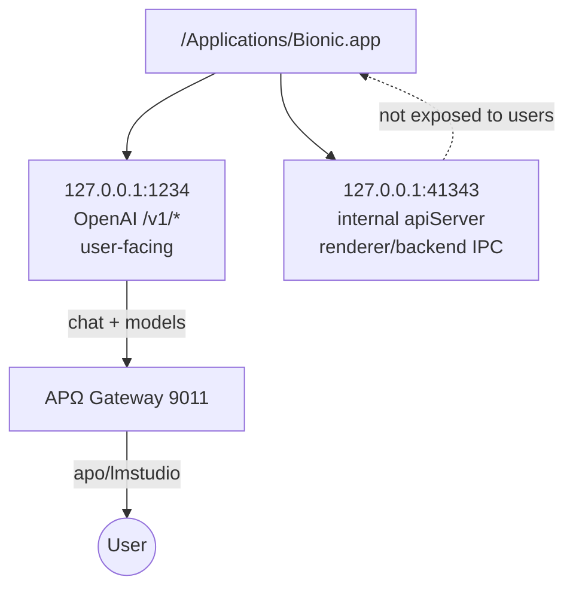

# SOCRATIC_VERIFICATION_CYCLE — Bionic Port 41343

**CycleID:** BIONIC-PORT-41343-001
**Timestamp:** 2026-07-29T11:25:00Z
**Mode:** SYSTEM_DETECTIVE / READ_ONLY
**FailClosed:** ACTIVE

---

## 1. QUESTIONS_ASKED

Q: **What is the purpose of Bionic's `127.0.0.1:41343` listening port?**

---

## 2. EVIDENCE_FOUND

| Domain | Evidence | Source | Timestamp |
|---|---|---|---|
| Identity | Bionic.app bundle ID `ai.elementlabs.bionic`; productName `Bionic`; main executable `/Applications/Bionic.app/Contents/MacOS/Bionic` | `Info.plist` | 2026-07-29T11:05Z |
| CurrentState | Process `Bionic` (PID 41654) listening on `127.0.0.1:41343` and `127.0.0.1:1234` | `lsof -i -n -P -a -c "Bionic"` | 2026-07-29T11:18Z |
| Dependency | `127.0.0.1:1234` responds to OpenAI `/v1/models` and `/v1/chat/completions`; `41343` does not | `curl` direct probes | 2026-07-29T11:18Z |
| Source | Webpack bundle contains `t.apiServerPorts=[41343,52993,16141,39414,22931]` | `grep 41343 .../renderer/mini_window.js` | 2026-07-29T11:24Z |
| Source | Bundle also contains `t.apiServerPorts=[0xa17f,0xcf01,0x3f0d,0x99f6,0x5993]` (hex equivalents) in `main/index.js` | `grep apiServerPorts .../main/index.js` | 2026-07-29T11:24Z |
| Endpoint | HTTP probes to `41343` for `/health`, `/api`, `/v1/models`, `/ws`, `/socket.io`, etc. returned 404 | `curl` loop | 2026-07-29T11:25Z |

---

## 3. VERIFIED_CONCLUSIONS

- `127.0.0.1:41343` is owned by the main Bionic process (PID 41654).
- It is an HTTP port (returns 404 on unknown paths, not connection refused).
- It is **not** the public OpenAI-compatible API; that is `127.0.0.1:1234`.
- The bundle explicitly defines `apiServerPorts` with 41343 as the first in a pool of ephemeral internal ports.
- Therefore, **41343 is Bionic's internal application API server port**, used for main-process / renderer / backend IPC, separate from the user-facing `1234` OpenAI endpoint.

---

## 4. NOT_PROVEN

- The exact route schema on 41343 is not known; minified bundle makes static extraction hard.
- Whether 41343 requires a special host header, token, or protocol framing is not verified.
- The specific messages passed through 41343 at runtime were not captured.

---

## 5. HISTORICAL_RECONCILIATION

- Previous lab report left `41343` as an unresolved contradiction.
- New evidence (bundle string + endpoint probe + lsof) resolves it from `UNKNOWN` to `INTERNAL_APP_SERVER`.
- It is now classified as an **internal** surface, not a user-facing integration point.

---

## 6. CANON_DELTA

- **Added:** Bionic listens on two distinct TCP ports:
  - `127.0.0.1:1234` → public OpenAI-compatible model catalog API.
  - `127.0.0.1:41343` → internal `apiServer` port for app IPC.
- **Retained:** Bionic is an LM Studio-derived local model runtime.
- **Superseded:** The previous `UNKNOWN` label for port 41343.

---

## 7. UPDATED_STATE_VECTOR

```json
{
  "component": "Bionic",
  "runtime_id": "ai.elementlabs.bionic",
  "process_pid": 41654,
  "ports": {
    "public_api": "127.0.0.1:1234",
    "internal_api": "127.0.0.1:41343"
  },
  "port_41343_class": "INTERNAL_APP_SERVER",
  "user_facing": false,
  "apΩ_integration_surface": "127.0.0.1:1234"
}
```

---

## 8. UPDATED_DIAGRAM



---

## 9. DECISION

- **Decision:** `VERIFIED_WITH_PROOF`
- **Reason:** Physical evidence (lsof, curl, bundle strings) directly answers the question.
- **Confidence:** HIGH
- **Invariants:** I₀, I₁, I₂, I₆, I₇ satisfied.
- **NextAction:** No mutation needed; record canon and move to next Socratic question.

---

## 10. NEXT_SOCRATIC_QUESTIONS

1. **Can the public Bionic API on 1234 expose `/v1/embeddings` for `text-embedding-nomic-embed-text-v1.5`, and can APΩ consume it?**
2. **Does Bionic expose a model download/install control plane that can be called programmatically?**
3. **Should APΩ add a dedicated `apo/bionic` alias to make the Bionic catalog independently addressable?**

---

## 11. ENCOURAGEMENT

The unknown port now has a concrete identity and a clear boundary — exactly the kind of evidence that prevents accidental integration into the wrong surface.
